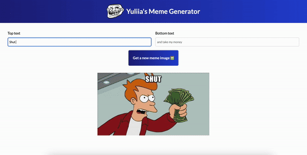

<h1 align="center">Meme Generator</h1>
 

 
&nbsp;&nbsp;&nbsp;&nbsp;&nbsp;&nbsp;Project Link: <a target="new" href="https://yuliia-kruta.github.io/meme-generator/">Live Demo</a>
    
 
<h2>Project description</h2>
The Meme Generator app is a fun and interactive web application built with <b>React</b>. It allows users to create custom memes by adding their own text to popular meme images. Simply click to fetch a new meme, add your captions, and create a shareable meme in seconds!

<h2>Features</h2>
<ul>
  <li>Fetch random meme images from a vast online collection using Imgflip API.</li>
  <li>Add custom text to both the top and bottom of meme images.</li>
  <li>Enjoy user-friendly interface with responsive design.</li>
</ul>

<h2>Technologies Used</h2>

<h2>Getting Started</h2>
To get a local copy up and running, follow these simple steps.

<h3>Prerequisites</h3>
Make sure you have npm installed. You can get it by installing Node.js.

<h3>Installation</h3>
<h5>Clone the repository:</h5>
https://github.com/Yuliia-Kruta/meme-generator.git

<h5>Navigate to the project directory:</h5>
cd meme-generator

<h5>Install the dependencies:</h5>
npm install

<h5>Start the development server:</h5>
npm start
  
The app will be available at http://localhost:3000.

<h2>How to Use</h2>
- Click the "Get a new meme image" button to fetch a random meme image. 
- Enter your custom text in the "Top text" and "Bottom text" input fields. 
- Your custom meme will be displayed with the selected image and your text. 

<h2>License</h2>
Distributed under the MIT License. See LICENSE for more information.

